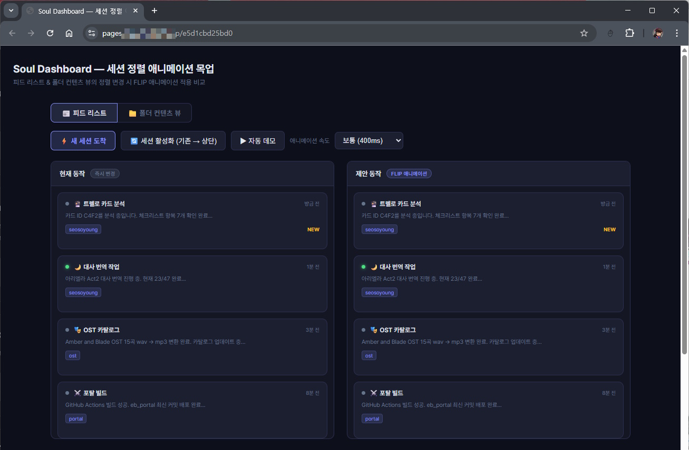

# pages

A lightweight HTML page hosting service. Clients upload HTML via a Bearer-token-authenticated API and receive a unique public URL; a Google OAuth-protected dashboard lets authorized users manage visibility and deletion.



## Features

- **HTML upload** — POST any HTML string and get back a stable `/p/:id` URL
- **Review annotations** — opt-in reviewable pages receive rev-scoped comment storage
- **Public / private toggle** — pages default to public; flip visibility from the dashboard
- **Google OAuth dashboard** — only allowlisted Google accounts can access `/` and manage pages
- **Bearer token auth** — API writes require `Authorization: Bearer <token>`
- **10 MB limit** — requests larger than 10 MB are rejected automatically

## Environment Variables

Create a `.env` file in the project root (see `.env.example` if present):

| Variable              | Description                                                    |
|-----------------------|----------------------------------------------------------------|
| `PORT`                | Port the server listens on (e.g. `3110`)                       |
| `PAGES_DIR`           | Absolute path to the directory where pages are stored          |
| `PAGES_API_TOKEN`     | Secret token required for `POST /api/pages`                    |
| `SESSION_SECRET`      | Secret used to sign the session cookie                         |
| `BASE_URL`            | Public base URL without trailing slash (e.g. `https://pages.example.com`) |
| `GOOGLE_CLIENT_ID`    | Google OAuth 2.0 client ID                                     |
| `GOOGLE_CLIENT_SECRET`| Google OAuth 2.0 client secret                                 |
| `ALLOWED_EMAILS`      | Comma-separated list of Google email addresses allowed to log in |

All variables are required. The server throws an error on startup if any are missing.

The annotation metadata database is stored as `pages-meta.sqlite` inside `PAGES_DIR`.

## API

### Upload a page

```
POST /api/pages
Authorization: Bearer <PAGES_API_TOKEN>
Content-Type: application/json

{
  "html": "<html>...</html>",
  "title": "My Report",      // optional, defaults to "(제목 없음)"
  "private": false,          // optional, defaults to false
  "reviewable": false,       // optional, defaults to false
  "webhookUrl": "https://example.com/hook", // optional, requires reviewable=true
  "webhookSecret": "<signing secret>"       // optional, requires webhookUrl
}
```

**Response `201`**

```json
{
  "id": "a1b2c3d4e5f6",
  "url": "https://pages.example.com/p/a1b2c3d4e5f6"
}
```

If `reviewable` is `true`, the response also includes a rev-scoped capability token and the stored HTML receives an inline `window.__PAGES_REVIEW__` config:

```json
{
  "id": "a1b2c3d4e5f6",
  "url": "https://pages.example.com/p/a1b2c3d4e5f6",
  "review": {
    "revId": "a1b2c3d4e5f6",
    "annotationsUrl": "/api/annotations/a1b2c3d4e5f6",
    "tokenHeader": "X-Pages-Annotation-Token",
    "capabilityToken": "<rev-scoped-token>",
    "expiresAt": "2026-06-29T00:00:00.000Z",
    "webhook": {
      "enabled": true,
      "signed": true
    }
  }
}
```

`webhookUrl` and `webhookSecret` are accepted only for reviewable pages. Page metadata stores `review.webhookUrl` and, when signing is enabled, `review.webhookSecretHash`; the raw signing secret is kept in the SQLite metadata store, not in the page JSON metadata or injected HTML.

### Annotation comments

```
GET /api/annotations/:revId
```

Returns the comments payload for one reviewable revision. Non-reviewable pages return `404`.

```
PUT /api/annotations/:revId
X-Pages-Annotation-Token: <capability token>
Content-Type: application/json

{
  "schema_version": "1.0",
  "document_id": "a1b2c3d4e5f6",
  "comments": []
}
```

`PUT` replaces the full comment set for the revision. The capability token is scoped to the single `revId` and expires automatically.

If the page has `review.webhookUrl`, a successful `PUT` queues a fire-and-forget webhook POST:

```json
{
  "event": "pages.annotations.updated",
  "rev_id": "a1b2c3d4e5f6",
  "count": 3,
  "annotations_url": "/api/annotations/a1b2c3d4e5f6",
  "page_url": "/p/a1b2c3d4e5f6",
  "timestamp": "2026-06-15T00:00:00.000Z"
}
```

When a webhook secret is configured, the request includes:

```
X-Pages-Webhook-Signature: sha256=<hex hmac over the exact JSON body>
```

Webhook delivery has a 5 second timeout, logs failures to stderr, and does not retry. Delivery failure does not change the `PUT` response.

### Other endpoints

| Method   | Path                             | Auth          | Description            |
|----------|----------------------------------|---------------|------------------------|
| `GET`    | `/p/:pageId`                     | none (public) | Serve the page         |
| `GET`    | `/api/annotations/:revId`        | none          | List review comments   |
| `PUT`    | `/api/annotations/:revId`        | capability    | Replace review comments |
| `PATCH`  | `/api/pages/:pageId/visibility`  | Google OAuth  | Toggle public/private  |
| `DELETE` | `/api/pages/:pageId`             | Google OAuth  | Delete a page          |
| `GET`    | `/`                              | Google OAuth  | Admin dashboard        |

## Running

```bash
npm install
node src/server.js
```

With pm2 (production):

```bash
pm2 start ecosystem.config.js
```

The `ecosystem.config.js` sets `cwd` via `process.env.HOME` to the symlink path managed by the deployment system. Do not change this to a relative path — the symlink is stable and pm2's working directory at startup time is not.
